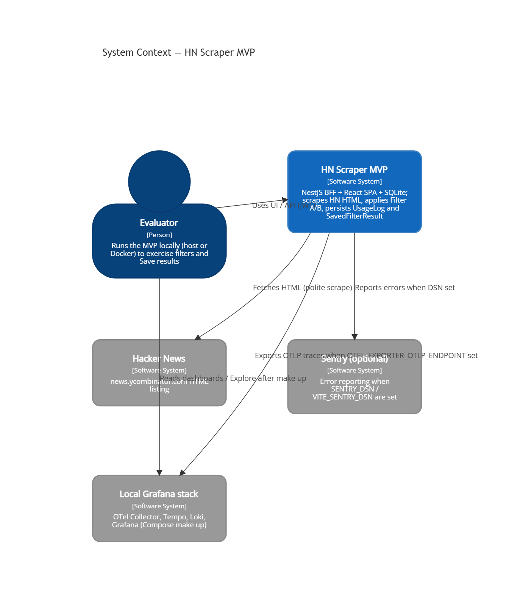
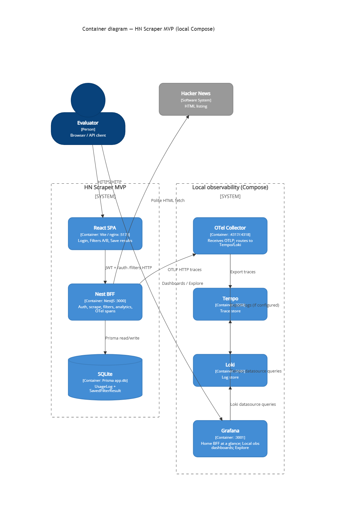
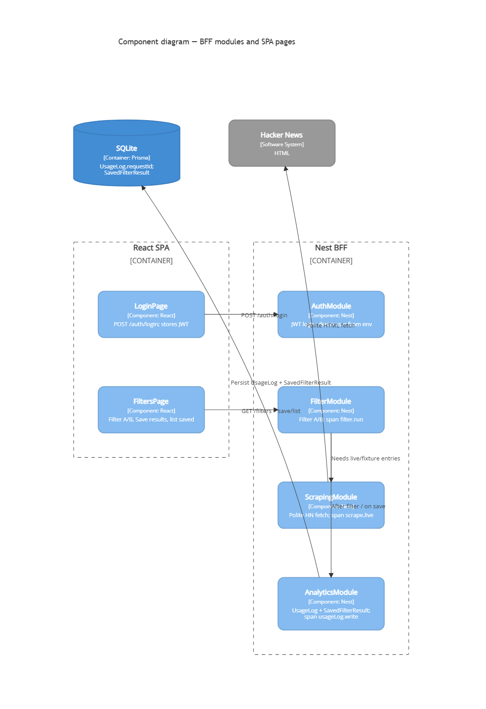

# Web-Scraping---SB

Hacker News scraper MVP for evaluators: log in, run Filter A/B on scraped HN listings, **Save results**, and optionally inspect request traces in local Grafana after `make up`.

## What / why

- **Objective:** NestJS BFF scrapes HN HTML, applies word-count filters, persists `UsageLog` + `SavedFilterResult` in SQLite; React SPA is the client (no browser scrape).
- **Prove it:** host `make install` → `make dev` → UI smoke; or Compose `make up` → UI + Grafana. Tests: `make test`, `make test-coverage`, Bruno with `E2E_SCRAPE_FIXTURE=1`.

## Stack

| Layer | Choice |
|--------|--------|
| BFF | NestJS (`@repo/backend`) — scrape, filters, auth, analytics |
| SPA | React + Vite (`@repo/frontend`) — Login, Filters/Save |
| Contracts | Zod in `@repo/shared-types` |
| DB | Prisma SQLite `apps/backend/prisma/app.db` — `UsageLog` (incl. `requestId`) + `SavedFilterResult` |
| Auth | JWT HS256; demo user from env |
| Obs | `x-request-id` + JSON logs; optional Sentry; optional OTLP → Compose Grafana/Tempo |
| Filters | A: `countWords(title) > 5`, comments DESC; B: `<= 5`, points DESC (rank ASC ties) |

## Prerequisites

- Node 22+
- pnpm (see `packageManager` in root `package.json`)
- **Docker Desktop** (or equivalent) only for Compose (`make up`)

## Quick start (host, no Docker)

```bash
make install
# equivalent: pnpm install --frozen-lockfile

cp apps/backend/.env.example apps/backend/.env
# optional: cp apps/frontend/.env.example apps/frontend/.env
pnpm --filter @repo/backend prisma:migrate

make dev
# equivalent: pnpm dev
```

- API: http://localhost:3000 — Swagger: http://localhost:3000/api
- UI: http://localhost:5173 — login → Filter A/B → **Save results**
- Rebuild shared types after schema edits: `pnpm --filter @repo/shared-types build`

`.env.example` files use **empty placeholders** for `SENTRY_DSN` / `VITE_SENTRY_DSN`. Leave empty unless you have a Sentry project. Never commit real `.env` secrets.

## Docker ecosystem (`make up`)

One-command local app + OpenTelemetry → Loki/Tempo/Grafana. Does **not** run Vitest/Bruno.

```bash
make up      # docker compose up -d --build
make logs    # follow backend container logs
make down    # stop stack
```

| Service | Host URL / port |
|---------|-----------------|
| BFF API | http://localhost:3000 |
| Frontend | http://localhost:5173 |
| Grafana | http://localhost:3001 (anonymous Admin for local Explore) |
| OTLP | 4317 (gRPC) / 4318 (HTTP) |

Secrets (`JWT_SECRET`, `DEMO_USER_PASSWORD`, optional `GRAFANA_ADMIN_PASSWORD`) come from the host environment or a Compose `.env` file — **never baked into image layers**. Copy values from `apps/backend/.env.example` into Compose env as needed.

**CI does not start Compose or Grafana.** Day-to-day without Docker: `make dev` / `make test`.

### Verify Grafana / OTel (after `make up`)

Service name: `hn-scraper-bff`. Spans: `scrape.live`, `filter.run`, `usageLog.write`. Correlate with `request.id` / header `x-request-id`. Polite-fetch attrs on scrape spans: `hn.fetch.outcome` (`cache` \| `live` \| `retry`) and optional `hn.fetch.wait_ms` (see dashboard “How to read” for TraceQL detail).

After UI login → Filter A/B → **Save results**, open Grafana (http://localhost:3001):

1. **Home — BFF at a glance** (`bff-overview.json`, Compose default via `GF_DASHBOARDS_DEFAULT_HOME_DASHBOARD_PATH`) — p50 cards, p95 chart, traffic, latest spans
2. **Dashboards → Local obs → BFF request list** (`bff-request-timings.json`) — per-stage tables
3. **Explore → Tempo** — one-request waterfall by `request.id` / `x-request-id`

## Commands

| Goal | Command |
|------|---------|
| Install | `make install` / `pnpm install --frozen-lockfile` |
| Dev (host) | `make dev` / `pnpm dev` |
| Build | `pnpm build` |
| Unit/integration | `make test` / `pnpm test` |
| CORE coverage | `make test-coverage` / `pnpm test:coverage` |
| Bruno E2E | `make test-e2e` / `pnpm test:e2e` (BFF already on :3000) |
| Lint | `make lint` / `pnpm lint` |
| Compose up/down/logs | `make up` / `make down` / `make logs` |

### Vitest

Workspace unit/integration tests (Turbo). Backend suites stay offline (fixture HTML / mocked scrape). No live `news.ycombinator.com` in Vitest.

### Evaluator evidence (scenario matrix + CORE coverage)

**Scenario matrix:** [`docs/qa/core-scenario-matrix.md`](docs/qa/core-scenario-matrix.md) — CORE happy/edge paths mapped to Vitest/Bruno with `PASS` / `WEAK` / `GAP`.

**Code coverage (CORE modules only):** `countWords` / schemas, backend `scraping/**` + `filtering/**`. Not a whole-repo 100% gate.

```bash
make test-coverage
```

HTML: `packages/shared-types/coverage/index.html`, `apps/backend/coverage/index.html`. LCOV under each `coverage/lcov.info`. `coverage/` is gitignored. CI uploads `core-coverage`; under-threshold CORE coverage fails the job.

### Bruno E2E

Backend must listen on `http://localhost:3000`. For non-vacuous HP2/HP3, set `E2E_SCRAPE_FIXTURE=1` on Nest (see `apps/backend/bruno/README.md`).

```bash
make test-e2e
```

Collection: `apps/backend/bruno/` (env `local`). HP1 login, HP2/HP3 filters, HP4/HP5 save+list, E1–E4 (401/400/save-401); E3 throttle last. Details in `apps/backend/bruno/README.md`.

## Architecture

C4 Context / Containers / Components (sources + regenerate notes: [`docs/architecture/`](docs/architecture/)):







- **BFF** owns scraping, filters, auth, persistence, and HTTP contracts.
- **Shared contracts** in `@repo/shared-types` (login + filter query/response + saved results).
- **SQLite:** `UsageLog` stores `requestId` and optional `scrape_duration_ms`; saved filter payloads in `SavedFilterResult`.
- **Observability:** inbound or generated `x-request-id` (echoed); JSON-line logs with `requestId` and stage; optional Sentry; optional OTLP for local Compose.

## Layout / branching

| Path / branch | Role |
|---------------|------|
| `apps/backend` | Nest BFF |
| `apps/frontend` | React SPA |
| `packages/shared-types` | Zod contracts |
| `deploy/` | OTel Collector, Loki, Tempo, Grafana provisioning |
| `docs/architecture/` | C4 Mermaid + PNG |
| `docs/qa/` | Scenario matrix |
| `main` | Stable / release |
| `develop` | Integration line |
| `feature/<story-id>-<slug>` | One OpenSpec change |

Flow: `feature/*` → PR → `develop` → (release) PR → `main`. Local gestor notes under `projects/**/_local/` are gitignored.

## Env examples

| File | Notes |
|------|--------|
| `apps/backend/.env.example` | `PORT`, `JWT_SECRET`, demo user, optional `SENTRY_DSN=`, optional `OTEL_EXPORTER_OTLP_ENDPOINT=`, optional `E2E_SCRAPE_FIXTURE=` |
| `apps/frontend/.env.example` | `VITE_API_BASE_URL`, optional `VITE_SENTRY_DSN=` |
| `.env.example` | Root convenience mirror |

Do not put production secrets in git. Empty Sentry DSN = SDKs stay off.

## CI

GitHub Actions: `.github/workflows/ci.yml` on `pull_request` and `push` to `develop` and `main`.

Order: `pnpm install --frozen-lockfile` → `pnpm test` → `pnpm test:coverage` (CORE thresholds + `core-coverage` artifact) → `pnpm lint` → backend with `E2E_SCRAPE_FIXTURE=1` → `pnpm test:e2e:ci` (Bruno HP1–5 + E1–E2 + E4). E3 throttle is local/`pnpm test:e2e`; EC-429 also covered by Vitest. No Docker Compose / Grafana in CI.

A failing Vitest, CORE coverage, Bruno, or lint fails the job. `SENTRY_DSN` empty in CI. `JWT_SECRET` and `DEMO_USER_PASSWORD` are step `env` values and must not be echoed in workflow logs.
